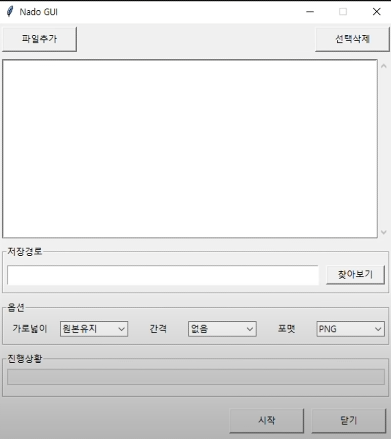

# 이미지 합치는 프로그램

> 파이썬을 이용한 여러 이미지를 합치는 프로그램

파이썬을 이용한 여러 이미지를 합치는 프로그램

## 사용 예제

사용 순서

1. 파일 추가
2. 저장 경로 설정
3. 옵션 선택 - 가로넓이 / 간격 / 포멧
4. 시작버튼 클릭

## 정보

다음의 강의를 참고하여 만들었습니다.  
**https://www.youtube.com/watch?v=bKPIcoou9N8&t=7919s**
